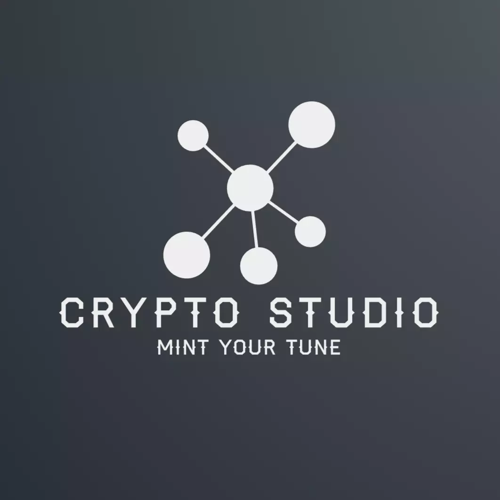
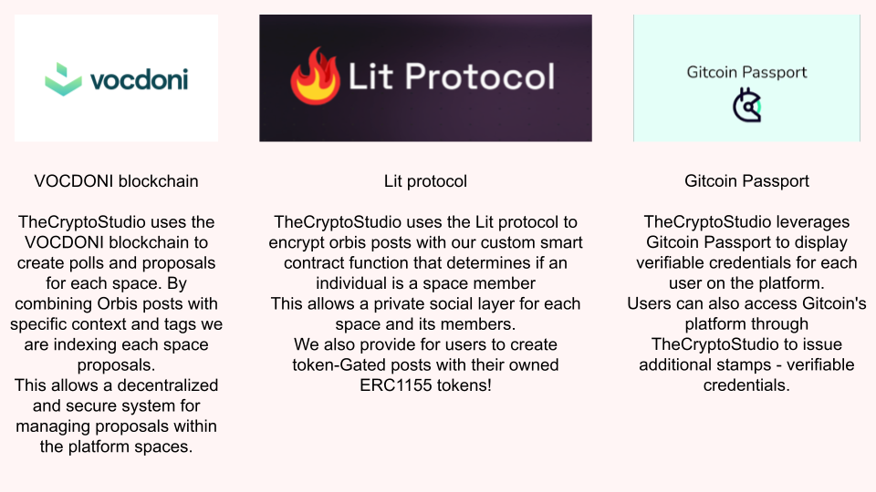

<h1>
 Welcome to The Crypto Studio
</h1>

[Demo video](https://youtu.be/I24-SiVT1fg)

to run on localhost just run
**yarn install**
**yarn dev**

Our application is hosted on that link.
 * [dapp link](https://the-crypto-studio.vercel.app/)

Authors
 * [nijoe1](https://github.com/nijoe1)
 * [Suhel-Kap](https://github.com/Suhel-Kap)

## Description
TheCryptoStudio is a decentralized social platform that allows users to create and monetize NFT (non-fungible token) ERC115 collections as a space. These spaces include features such as a group chat, posts, and proposals, and each user has a profile showing their own posts and NFTs. The platform also includes the option to encrypt posts using the Lit protocol and custom or token-gated encryption rules, as well as verifiable credentials provided by Gitcoin Passport. Overall, TheCryptoStudio is designed to be a hub for NFT communities to connect and interact with one another.

The Crypto Studio Collection supports all kind of NFTs like :

  * Interactive visualizers using the CID of HTML pages 
  * Song Albums for singers,trapers,electronic music creators
  * Just classic Image NFTs
  * Ticket NFTs
  
We provide them all of them from our UI!

[Collection on OpenSea](https://testnets.opensea.io/collection/thecryptostudio)

 
 ## ARCHITECTURE

 
# Technologies Used

 
This is how we used the Vocdoni SDK - Lit Protocol - Gitcoin Passport -  Orbis SDK
   
  
  
  **Vocdoni SDK** 
     
        We are leveraging Vocdoni SDK with the help of Orbis.club to record space Proposals and Polls as Posts with a specific tag . We also created the components to create Proposals and polls and display them in our UI and also giving to the allowed addresses the abillity to vote. By default the specified members that can take part into a poll or proposal are the followers of a certain space, but the poll creator can filter them with only the SpaceMembers or only to the spaceArtists granted by our smartContract or to people with certain Verifiable Credentials using LitProtocol and Gitcoin Passport!!!
     
    **Here are the code snippets that we are using Vocdoni to Create,Vote and render Proposals**
     
   **https://github.com/Suhel-Kap/the-crypto-studio/blob/main/hooks/useVocdoni.ts**
    
   **https://github.com/Suhel-Kap/the-crypto-studio/blob/main/components/PollCreationForm.tsx**
    
   **https://github.com/Suhel-Kap/the-crypto-studio/blob/main/components/CastVote.tsx**
    
   **https://github.com/Suhel-Kap/the-crypto-studio/blob/main/components/Polls.tsx**
    
   
    **Lit Protocol** 
     
        We are using Lit Protocol by leveraging their SDK to encrypt posts  
         
        In our implementation we are using the **erc1155 tokenGated access control** and our custom rule from our smart contract for posts - channels created into our dapp
         
        TheCryptoStudio uses the Lit protocol to encrypt orbis posts with our custom smart contract function that determines if an individual is a space member
        This allows a private social layer for each space and its members.
        We also provide for users to create token-Gated posts with their owned ERC1155 tokens!
         
        **Here are the code snippets that we are using Lit Protocol to encrypt and decrypt Posts**
         
        **https://github.com/Suhel-Kap/the-crypto-studio/blob/main/components/PostInput.tsx**
         
        **https://github.com/Suhel-Kap/the-crypto-studio/blob/main/components/PostCard.tsx**
    
    
    **Gitcoin Passport** 
     
        We are using Gitcoin Passport by leveraging the Orbis SDK to display to each UserProfile their Verifiable Credentials but also we are using the VCs to lock content and finally to assign into a Vocdoni Proposal only members with the isHuman Verifiable Credential to be sure that no bot is able to vote into that proposal.
         
        **Here is the code snippet that we are leveraging GitcoinPassport**
         
        **https://github.com/Suhel-Kap/the-crypto-studio/blob/main/components/UserVcs.tsx**
   
   
   **Orbis SDK** 
     
       The Crypto Studio uses the orbis SDK, built on the Ceramic network, to power its decentralized social platform. Orbis provides us user profiles, posts, and spaces for organization and collaboration managment, as well as tools for creating polls (via Vocdoni), posts, encrypted posts (via Lit Protocol), and NFTs. All of this information is stored on the Ceramic network to ensure a decentralized and secure environment. Orbis plays a key role in enabling The Crypto Studio to function as a decentralized social platform and provide a range of features for users to connect and engage with NFT communities.
         
         **https://github.com/Suhel-Kap/the-crypto-studio/blob/main/components/ChatContent.tsx**
          
         **https://github.com/Suhel-Kap/the-crypto-studio/blob/main/components/ChatBox.jsx**
          
         **https://github.com/Suhel-Kap/the-crypto-studio/blob/main/pages/create-nft.tsx**
          
         **https://github.com/Suhel-Kap/the-crypto-studio/blob/main/components/UpdateProfile.tsx**
          
          
  **NFT.STORAGE**
      
       All the files that consist an NFT are stored on the IPFS network using NFT.STORAGE
       The code snippets that are using NFT.STORAGE modules are located here:
        
        **https://github.com/Suhel-Kap/the-crypto-studio/blob/main/hooks/useNftStorage.ts**
         
        **https://github.com/Suhel-Kap/the-crypto-studio/blob/main/pages/create-nft.tsx**
         
        **https://github.com/Suhel-Kap/the-crypto-studio/blob/main/pages/api/updateHtml.ts**
     
   

   ## Tableland usage 
  Tableand is used to create the metadata layer of the Crypto Studio NFTs inside the Smart Contract
     take a deeper look in the SmartContract 
      
     
  Here are the data inside the SQL Tables. Only our SmartContract has access control on the tables!!!
  Check our decentralized databases content :
      
   main_table = **https://testnet.tableland.network/query?s=SELECT%20*%20FROM%20main_80001_4655**
        
  attribute_table = **https://testnet.tableland.network/query?s=SELECT%20*%20FROM%20attribute_4656**
        
  spaces_table = **https://testnet.tableland.network/query?s=SELECT%20*%20FROM%20space_group_80001_4657**
  
  space_Artists_table =**https://testnets.tableland.network/query?s=SELECT%20*%20FROM%20space_group_80001_4658**
 
  ## SmartContract
  Our contract is deployed and verified on polygon mumbai here is the mumbaiScan Link . 
 
####https://mumbai.polygonscan.com/address/0xC2df717A00c751cfBE03E1b4f07e65CCa5b9a524#code

 
 ---
 
