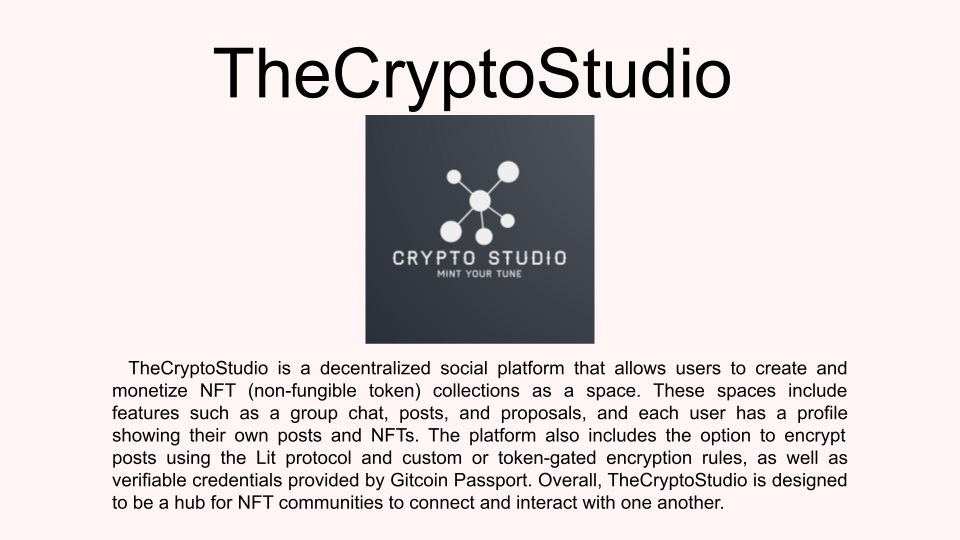
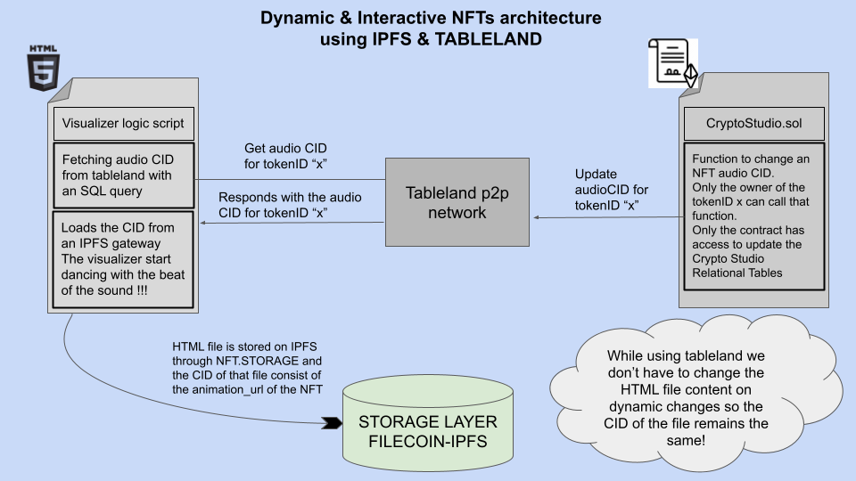

<h1>
 Welcome to The Crypto Studio
</h1>

[Demo video](https://youtu.be/e4lI4cYYG3U)

Our application is hosted on those links 
 * [stable dapp link](https://the-crypto-studio.vercel.app/)
 * [Valist IPFS link](https://bafybeieekfc5qpb5253kom33wlw3hb75w62ug3ob34upylkwf22ikf7axu.ipfs.gateway.valist.io/)
 * [Spheron IPFS link](https://the-crypto-studio-20be90.spheron.app/)
 

Authors
 * [nijoe1](https://github.com/nijoe1)
 * [Suhel-Kap](https://github.com/Suhel-Kap)

## Description
Crypto Studio is a Dynamic ERC1155 Collection built for digital artists - Influencers and Everyone that wants to create a decentralized and a tokenGated Community with the help of the CERAMIC network , the Orbis.club intergration and the vocdoniSDK. Under the hood, we are utilizing tableland a new narrative that brings SQL into smart contracts that unlocked us to create a native dynamic experience for our users NFTs. We are also leveraging IPFS for storing (images - HTML - mp3) files for our NFTs into the network through NFT.STORAGE. 

The Crypto Studio Collection supports all kind of NFTs like :

  * Interactive visualizers using the CID of HTML pages 
  * Song Albums for singers,trapers,electronic music creators
  * Just classic Image NFTs
  * Ticket NFTs
  
We provide them all of them from our UI!

[Collection on OpenSea](https://testnets.opensea.io/collection/cryptostudio-2xpo9crut9)

Each Artist/User first has to mint a Space. A space is like his signature on top of his NFTs. Digital artists can create a whole Collection|Album based on their space.A space is nothing more that a pair (trait_type = SpaceName , value = "A name space") on top of every NFT. Artists can only Decalre an NFT on top of their owned spaces. If they dont grab a unique space or they have not hired by other space Admins as a spaceArtist they are not allowed to Declare their creations.

Our platform is open to everyone:
  * We provide an open enviroment for people to create their prefered decentralized Communities using ERC1155 NFTs, Orbis.club , Vocdoni , LitProtocol and GitcoinPassport through the Orbis SDK   
  * An NFT can represent a PFP, Audio, HTML page, dynamic HTML page, tickets
  * For now, we are providing some precoded dynamic & interactive audio visualizers as Dynamic HTML pages for newcomers to come and mint them with their preferred soundtrack and change it whenever they want to.
  * The future of CryptoStudio is to make it more accessible to the public. We want to make it so that anyone can create their own Dynamic NFTs with zero coding experience by creating a free and open to use web-based tool for designing and developing dynamic 2D & 3D NFT models by introducing **The Studio Playground**
  * We also want to make it so that digital artists can come and build cool things by providing a guide (DOCS) of how to use our native Dynamic features written   natively inside the CryptoStudio smart contract on top of their creations.

Our NFTs are based on HTML files and a p5.js script for playing the visualizer and the sound. In the upcoming versions we are going to use more libraries like p5.js.

The HTML file is getting uploaded on IPFS and that derives the animation_url that is part of the NFT metadata.

The dynamic features for changing the audio track of an NFT come into place by using the changeNFTaudio function which is located inside our contract. This function can be called only by the Owner of an NFT that wants to change the soundtrack of his NFT. The contract interacts with tableland to update the audio column of that NFT with the new audio CID!
  * We also added the addAttribute & updateAttribute functions for users to monetize their NFTs us they want ( Add , remove , update ) attributes and create new   dynamic utilities

NFT owners can add and update their NFT metadata by interacting with the cryptoStudio Smart contract as they want except the animationURL and the spaceName trait attributes, to keep the basic art and the creatorSignature immutable.

 
 **Here is the prototype Architecture of our Platform** 

 
 **Intergrated Technologies** 

 
 
**Here is the prototype Architecture of our NFTs** 

Here is an HTML example :
 
https://github.com/Suhel-Kap/the-crypto-studio/blob/main/constants/nfts/nft7.html

## SOCIAL_LAYER
 
Each user has his profile based on the ceramic network using orbis.club

We also include a public grouChat for anyone into cryptoStudio to connect with each other. This is established by using Orbis.club and ceramic network which is an IPFS implementation!

Each collection space contains a seperated group chat with tokengated access controll by leveraging Orbis.club & lit.protocol for the spaceNFT owners and give them a decentralized discord experience.

# Technologies Used
  
  This is how we used the Orbis SDK - Vocdoni SDK - Lit Protocol
   
   **Orbis SDK** 
     
        We are leveraging Orbis.club for our users Profiles , their posts(Encryppted or Not), their Verifiable Credentials and for creating a communication layer for each Space like a discord space but decentralized. Each space has posts - channels and Vocdoni Proposals||Polls all of them can get encrypted using tokenGated , custom rules or by a certain Verifiable Credential holders using LitProtocol the Orbis SDK and our SmartContract to achive custom ecryptionRules  
        but also a unified and open GroupChat for the Crypto Studio users!
         
         **https://github.com/Suhel-Kap/the-crypto-studio/blob/main/components/ChatContent.tsx**
          
         **https://github.com/Suhel-Kap/the-crypto-studio/blob/main/components/ChatBox.jsx**
          
         **https://github.com/Suhel-Kap/the-crypto-studio/blob/main/pages/create-nft.tsx**
          
         **https://github.com/Suhel-Kap/the-crypto-studio/blob/main/components/UpdateProfile.tsx**
          
        
    **Vocdoni SDK** 
     
        We are leveraging Vocdoni SDK with the help of Orbis.club to record space Proposals and Polls as Posts with a specific tag . We also created the components to create Proposals and polls and display them in our UI and also giving to the allowed addresses the abillity to vote. By default the specified members that can take part into a poll or proposal are the followers of a certain space, but the poll creator can filter them with only the SpaceMembers or only to the spaceArtists granted by our smartContract or to people with certain Verifiable Credentials using LitProtocol and Gitcoin Passport!!!
     
    **Lit Protocol** 
     
        We are using Lit Protocol by leveraging the Orbis SDK 
         
        In our implementation we are using the **erc1155 tokenGated access control** for posts - channels created into our dapp
         
        We also created two functions inside our Contract to check if someone is a groupMember or if someone is a spaceArtist that gave us the opportunity to create **custom access control rules** and give access to dectypt posts or channels content only by the spaceMembers or spaceArtists recorded in a decentralized manner by our contract
    
    
    **Gitcoin Passport** 
     
        We are using Gitcoin Passport by leveraging the Orbis SDK to display to each UserProfile their Verifiable Credentials but also we are using the VCs to lock content and finally to assign into a Vocdoni Proposal only members with the isHuman Verifiable Credential to be sure that no bot is able to vote into that proposal.
         
        
  **NFT.STORAGE**
      
       All the files that consist an NFT are stored on the IPFS network using NFT.STORAGE
       The code snippets that are using NFT.STORAGE modules are located here:
        
        **https://github.com/Suhel-Kap/the-crypto-studio/blob/main/hooks/useNftStorage.ts**
         
        **https://github.com/Suhel-Kap/the-crypto-studio/blob/main/pages/create-nft.tsx**
         
        **https://github.com/Suhel-Kap/the-crypto-studio/blob/main/pages/api/updateHtml.ts**
     
     
   

   ## Tableland usage 
  Tableand is used to create the metadata layer of the Crypto Studio NFTs inside the Smart Contract
     take a deeper look in the SmartContract 
      
     
  Here are the data inside the SQL Tables. Only our SmartContract has access control on the tables!!!
  Check our decentralized databases content :
      
  main_table = **https://testnet.tableland.network/query?s=SELECT%20*%20FROM%20main_80001_4601**
        
  attribute_table = **https://testnet.tableland.network/query?s=SELECT%20*%20FROM%20attribute_4602**
        
  spaces_table = **https://testnet.tableland.network/query?s=SELECT%20*%20FROM%20space_group_80001_4603**
 
  ## SmartContract
 
  Our contract is deployed and verified on polygon mumbai here is the mumbaiScan Link . 
 
####https://mumbai.polygonscan.com/address/0x19f1C98534C647Bc8a33F14c777a959BFA9f14dD#code

 
 ---
 
